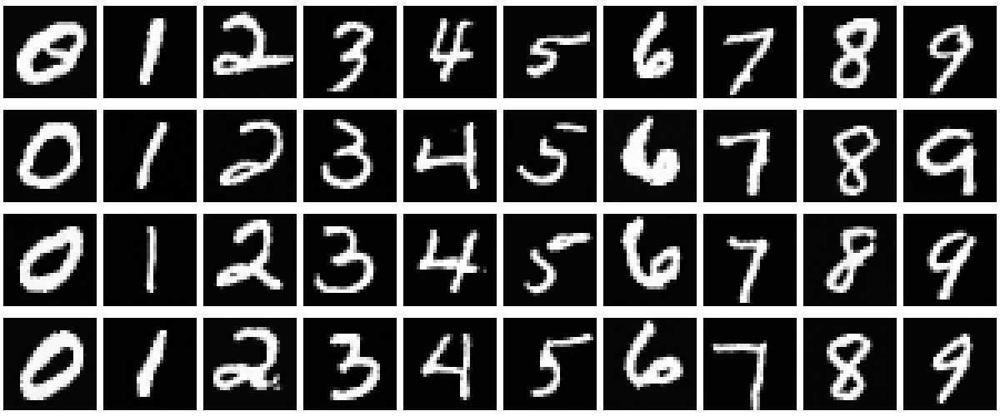

# DDPM_MNIST

This is the simple implementation of conditional diffusion model (ddpm, ddim) for MNIST dataset. Most codes are modified from another repository [https://github.com/tatakai1/classifier_free_ddim/tree/main](https://github.com/tatakai1/classifier_free_ddim/tree/main). Please check more details from the link if necessary.

 

To reproduce the results, please run `main.py` to conduct the experiments. During the initial run, the MNIST dataset will be downloaded into the `dataset/mnist/` directory, so ensure that your Internet connection is active.

 

If you want to obtain our pretrained model directly, please download `DDPM.h5` from our Google Device: [https://drive.google.com/drive/folders/1Wk7Lcj2eInvZNo2ndPsumC8XtxPvjbcb?usp=sharing](https://drive.google.com/drive/folders/1Wk7Lcj2eInvZNo2ndPsumC8XtxPvjbcb?usp=sharing). 
You shoule put the file into the `./saved_models/` directory, or change the `model_path` variable in `main.py` to load the model. You can also check the git image from the link.
